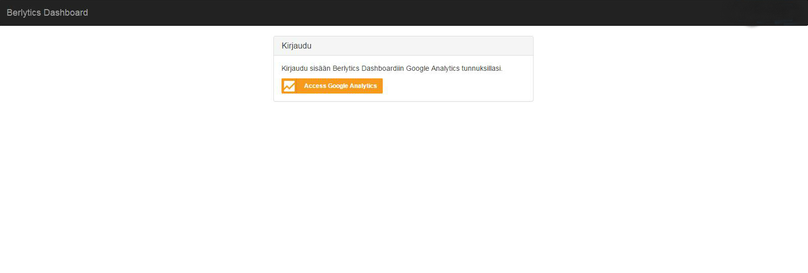
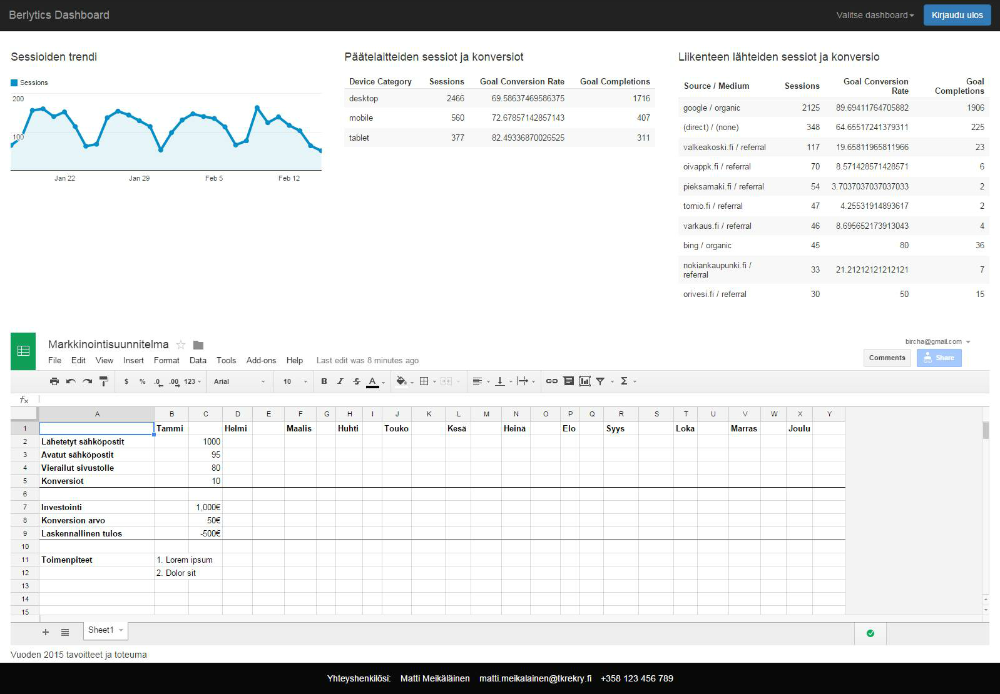

# Berlytics - prototype dashboard - proto-dash

## What is this
Prototype of a customizable widget based analytics dashboard, code name "Berlytics". It was put together as an launching platform for ideas by two mad scientists and to try out few potential analytics ideas.

Obviously if you want a full featured, customizable analytics dashboard, you'll want to look into <a href="http://www.klipfolio.com/">klipfolio</a> and the like.

The prototype served many purposes and one of them being to see what it would require to build a customizable analytics board that would allow easy customization of different dashboards and how well that raw analytics information then would translate into human readable (and understandable) context.

## Where can I try this?
There is a demo server available but we cannot provide you with access unfortunately. Why? To allow access to Berlytics, you would need to have access to the used Embed API views (this is completely handled by Google) before hand. As Google performs the authorization against the email you use the service with and if the analytics information owner has not provided you with access to the analytics data, you cannot view them. I would love to allow you to see it but as of now.. I cannot predict the future and I do not know your e-mail. :smile: Sorry.

### Pretty pictures
Login screen

Example dashboard

## How far did it come?
Berlytics has fairly good support for Embed api (v3 mainly) as that's what we used mainly in the prototype.

 * Support for different types of widgets
  * iframe (for google docs mainly to view marketing information from shared excels etc.)
  * image
  * analytics (embed api based)
 * Per user customizable dashboards
 * Multiple dashboards per user
 * Providing the dashboard with customer support information

## What next?
Well, the prototype server its purpose and we are moving forward onto other projects. It was never meant to be a full featured application but a prototype that has some rought edges around it.

## Technologies used
 * Languages
  * Javascript (EcmaScript 6!)
  * CSS
  * HTML5

 * Database
  * Mongodb

 * Backend
  * Node.js

 * Frontend
  * Google API (gapi)
  * AngularJS
  * Jade
  * Browserify

 * Package management / Handling
  * Bower
  * NPM

 * Heroku

# List of active TODO items
<a href="TODO.md">Link to TODO</a>

We could continue as far as we want with this project and there is A LOT more to be done to the project than the almost empty TODO list. But for now, this will do, the prototype has server its purpose and we can conclude: yes, it's fairly easy to throw together a customizable dashboard but it might not be reasonable or cost-effective to try and compete with SaaS-services that already do this :) Fur stuff nonetheless!
